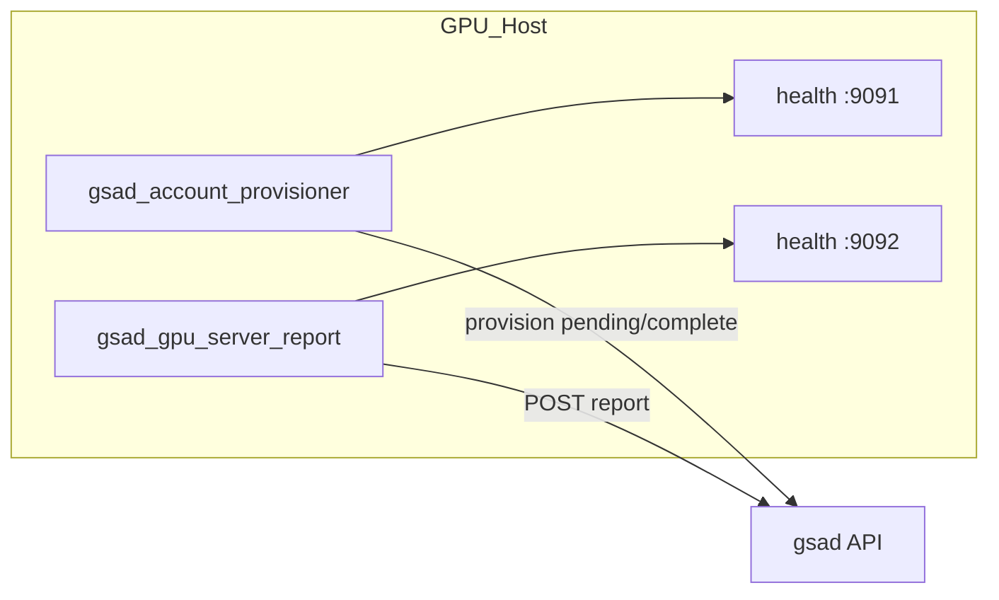

# server-agent

GPU host agents for [gsad](../backend/gsad/) (GPU Server Access Dashboard, GSAD): poll the backend for account grant/revoke tasks and report GPU metrics.

| Agent | Role |
|-------|------|
| [account-provisioner](account-provisioner/) | Runs `isolation` scripts to create/remove Linux users |
| [gpu-server-report](gpu-server-report/) | Collects `nvidia-smi` metrics and POSTs to gsad |

Production deployment uses **systemd on the GPU host** (not Docker). The provisioner needs host `sudo`, `DATA_ROOT`, NetBird, and the `isolation` submodule.

---

## Architecture



### Hostname and `server_id`

Agent `hostname` must match gsad `t_server.server_id` (and `t_server.hostname`) exactly, for example `gpu-node-01`.

Set the same `AGENT_HOSTNAME` in both agents on a given host.

---

## Prerequisites

- Linux GPU server with NVIDIA driver and `nvidia-smi` (reporter)
- [uv](https://docs.astral.sh/uv/) pre-installed (Python 3.11+ managed by uv)
- Passwordless `sudo` for the service user, or run provisioner as root
- NetBird client connected (`netbird status --ipv4`) or explicit `PROVISION_SERVER_IP`
- Reachable gsad API and matching `AGENT_PSK`
- `DATA_ROOT` absolute path (e.g. `/data`) initialized for isolation scripts
- Git checkout with submodules: `git clone --recursive …`

---

## Quick install

From this directory on the GPU host:

```bash
git clone --recursive <repo-url> /tmp/server-agent
cd /tmp/server-agent

# Optional: inject secrets non-interactively
sudo GSAD_API_URL=https://gsad.example \
     AGENT_PSK=your-psk \
     AGENT_HOSTNAME=gpu-node-01 \
     ./deploy/install.sh

# If uv is not on root's PATH (e.g. ~/.local/bin/uv), the installer probes
# the sudo caller's home. Override explicitly when needed:
sudo UV_BIN=/home/you/.local/bin/uv ./deploy/install.sh
```

The installer:

1. Copies agents to `/opt/gsad-agent/`
2. Creates `/etc/gsad-agent/{common,provisioner,reporter}.env` (does not overwrite existing files)
3. Runs `uv sync --frozen` in each agent directory (requires uv in PATH, sudo caller's `~/.local/bin`, or `UV_BIN`)
4. Writes systemd units with the resolved uv path and starts services

Edit configuration before production use:

```bash
sudo editor /etc/gsad-agent/common.env
sudo editor /etc/gsad-agent/provisioner.env
sudo editor /etc/gsad-agent/reporter.env
sudo systemctl restart gsad-account-provisioner gsad-gpu-server-report
```

---

## Configuration layout

| File | Purpose |
|------|---------|
| `/etc/gsad-agent/common.env` | `GSAD_API_URL`, `AGENT_PSK`, `AGENT_HOSTNAME` |
| `/etc/gsad-agent/provisioner.env` | `DATA_ROOT`, `PROVISION_*`, health port `9091` |
| `/etc/gsad-agent/reporter.env` | `AGENT_REPORT_INTERVAL`, health port `9092` |

`REPORT_API_URL` in reporter env is optional; when unset, `GSAD_API_URL` from `common.env` is used.

File mode: `600 root:root`.

---

## Upgrade

```bash
cd /path/to/server-agent
git pull
git submodule update --init --recursive
sudo ./deploy/install.sh
```

Existing `/etc/gsad-agent/*.env` files are preserved. Agent code under `/opt/gsad-agent/` is replaced.

---

## Uninstall

```bash
sudo ./deploy/uninstall.sh          # stop services, keep /opt and /etc
sudo ./deploy/uninstall.sh --purge  # also remove /opt/gsad-agent and /etc/gsad-agent
```

---

## Monitoring

### Health endpoints (localhost)

| Agent | Default URL |
|-------|-------------|
| account-provisioner | `http://127.0.0.1:9091/health` |
| gpu-server-report | `http://127.0.0.1:9092/health` |

Example response (provisioner):

```json
{
  "ok": true,
  "agent": "account-provisioner",
  "hostname": "gpu-node-01",
  "lastPollAt": "2026-06-18T12:00:00+00:00",
  "lastPollOk": true,
  "lastError": null
}
```

Set `AGENT_HEALTH_PORT=0` to disable.

### Logs

```bash
journalctl -u gsad-account-provisioner -u gsad-gpu-server-report -f
systemctl status gsad-account-provisioner gsad-gpu-server-report
```

---

## Why not Docker?

The account provisioner executes host `sudo` scripts, creates real Linux users, and uses `DATA_ROOT` on the host filesystem. Running it in a container would require privileged mode, host mounts, and NetBird inside the container — more fragile than a native systemd service.

The metrics reporter can run in a container with the NVIDIA runtime, but keeping both agents on systemd simplifies operations on GPU nodes.

---

## Development

Run agents manually from each subdirectory (see their README files). Use gsad `docker compose` with `account-provision-mock` for integration testing without real isolation scripts.

---

## Links

- [account-provisioner README](account-provisioner/README.md)
- [gpu-server-report README](gpu-server-report/README.md)
- [gsad agent provision API](../backend/gsad/agent-provision.md)
